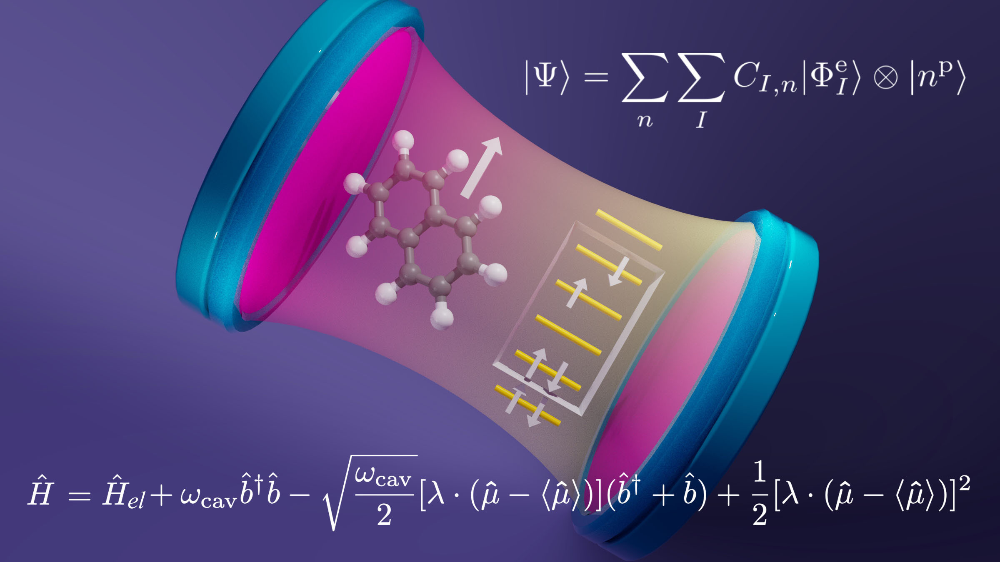

## Polaritonic chemistry:
Polaritonic Chemistry is an emerging field at the intersection of chemistry, quantum optics, and photonics, exploring the profound effects of strong coupling between molecules and light. In traditional chemistry, the interaction between molecules and light is often considered a perturbation, but in polaritonic chemistry, the coupling between molecular excitations and cavity photons can lead to new and intriguing phenomena. This strong interaction can dramatically alter the electronic and vibrational properties of molecules, resulting in the formation of polaritonic states with unique energy landscapes and reactivity. By manipulating these polaritonic states, researchers aim to control chemical reactions, enhance light-matter interactions, and design novel materials with tailored optical and chemical properties.

## Parameterized cavity quantum electrodynamics(PCQED):

This notebook contains code for PCQED, an ab initio cavity quantum electrodynamics approach for polaritonic chemistry. This method provides a detailed and rigorous description of the strong light-matter interactions. This approach involves solving two Schrödinger equations in series: a first for the molecular system alone using traditional tools of ab initio quantum chemistry, and the second for the coupled molecular-photonic system that is parametrized by the solutions to the molecular problem.  

